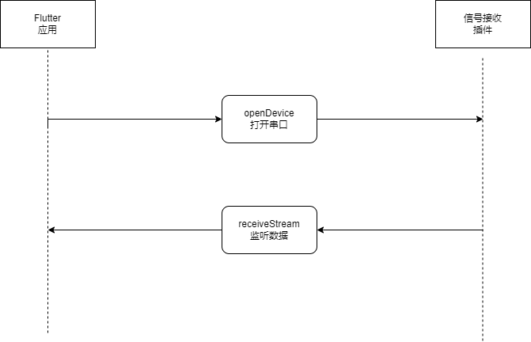

# signal_scaner

D80 信号板，信号接收Flutter插件，内部项目使用

## 应用调用插件方式

* 应用端向插件端发送[打开串口]方法调用，这时会打开串口设备并开启线程读取串口中的数据，并同步串口设备时间
* 第一步成功后，通过实现接口，调用CallBackIOData向eventChannel发送json数据
* 应用端监听[receiveStream]，完成数据接收

