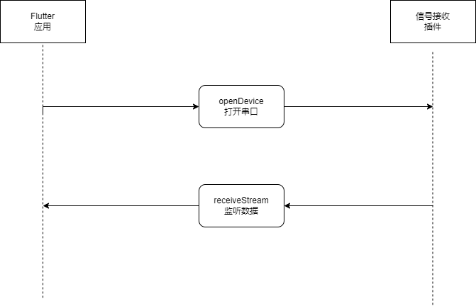

# signal_scaner

D80 信号板信号接收 Flutter 插件，用于与 D80 信号板通过串口通信，实时接收信号状态数据。

## 功能特性

- **串口通信**: 通过 Android 串口 API 与 D80 信号板建立连接
- **实时数据流**: 使用 EventChannel 实时推送信号状态变化
- **多架构支持**: 支持 ARM (armeabi, armeabi-v7a, arm64-v8a) 和 x86 (x86, x86_64) 架构
- **JSON 数据格式**: 返回标准化的 JSON 格式数据，包含时间戳和信号状态数组
- **自动时间同步**: 同步串口设备时间并转换为标准时间格式

## 系统要求

- **Flutter**: >= 3.3.0或flutter3.41.6
- **Dart SDK**: >= 3.11.4
- **Android**: minSdkVersion 24 (Android 7.0+)
- **硬件**: 支持串口通信的 Android 设备，D80 信号板

## 安装

### 1. 添加依赖

在 `pubspec.yaml` 文件中添加依赖：

```yaml
dependencies:
  signal_scaner:
    git:
      url: https://github.com/ChenWes/signal_scaner
      ref: main
```

### 2. 导入包

```dart
import 'package:signal_scaner/signal_scaner.dart';
```

### 3. Android 配置

修改 `android/settings.gradle`，在文件末尾添加以下配置（仅针对 Android Studio 调试）：

```gradle
// 在 Android Studio 调试时将 so 文件打包
gradle.beforeProject({ project->
    if (project.hasProperty("target-platform") && !project.getProperty("target-platform").split(",").contains("android-arm")) {
        project.setProperty("target-platform", "android-arm")
    }
})
```

此配置确保在调试时正确打包 native 库文件。

## 快速开始

### 基本使用流程



1. **打开串口设备**: 调用 `SignalScaner.openDevice` 方法打开串口连接
2. **监听数据流**: 订阅 `SignalScaner.receiveStream` 接收实时数据
3. **处理数据**: 解析返回的 JSON 数据，更新应用状态

### 示例代码

```dart
import 'package:flutter/material.dart';
import 'package:signal_scaner/signal_scaner.dart';

class SignalMonitorPage extends StatefulWidget {
  const SignalMonitorPage({super.key});

  @override
  State<SignalMonitorPage> createState() => _SignalMonitorPageState();
}

class _SignalMonitorPageState extends State<SignalMonitorPage> {
  String _deviceStatus = '未连接';
  List<String> _signalData = [];

  @override
  void initState() {
    super.initState();
    _initializeSignalScanner();
  }

  Future<void> _initializeSignalScanner() async {
    try {
      // 1. 打开串口设备
      final String? result = await SignalScaner.openDevice;
      
      if (result == 'openDeviceSuccess') {
        setState(() {
          _deviceStatus = '已连接';
        });

        // 2. 监听数据流
        SignalScaner.receiveStream.listen((event) {
          // 3. 处理接收到的数据
          final Map<String, dynamic> data = json.decode(event);
          final String timestamp = data['time'];
          final List<dynamic> states = data['totalState'];
          
          setState(() {
            _signalData.add('$timestamp: ${states.join(', ')}');
          });
        }, onError: (error) {
          print('数据接收错误: $error');
        });
      } else {
        setState(() {
          _deviceStatus = '连接失败';
        });
      }
    } catch (e) {
      setState(() {
        _deviceStatus = '错误: $e';
      });
    }
  }

  @override
  Widget build(BuildContext context) {
    return Scaffold(
      appBar: AppBar(title: const Text('D80 信号监控')),
      body: Column(
        children: [
          Text('设备状态: $_deviceStatus'),
          Expanded(
            child: ListView.builder(
              itemCount: _signalData.length,
              itemBuilder: (context, index) {
                return ListTile(title: Text(_signalData[index]));
              },
            ),
          ),
        ],
      ),
    );
  }
}
```

## API 参考

### SignalScaner 类

#### 静态属性

| 属性 | 类型 | 说明 |
|------|------|------|
| `platformVersion` | `Future<String?>` | 获取平台版本信息 |
| `receiveStream` | `Stream` | 数据接收流，返回 JSON 字符串 |

#### 静态方法

| 方法 | 返回类型 | 说明 |
|------|----------|------|
| `openDevice` | `Future<String?>` | 打开串口设备，返回操作结果 |

### 数据格式

#### 成功打开设备
```json
"openDeviceSuccess"
```

#### 接收到的数据格式
```json
{
  "time": "2023-12-01 14:30:45.123",
  "totalState": [1, 0, 1, 0, 1, 1, 0, 0]
}
```

- **time**: 时间戳，格式为 `YYYY-MM-DD HH:mm:ss.SSS`
- **totalState**: 信号状态数组，每个元素代表一个信号通道的状态（1=高电平，0=低电平）

## 工作原理

### 架构概览

```
Flutter 应用层
    ↓ (MethodChannel)
SignalScaner 插件层
    ↓ (JNI/FFI)
Android 原生层 (SignalScanerPlugin)
    ↓ (串口 API)
D80 信号板硬件
```

### 数据流

1. **初始化**: Flutter 应用调用 `openDevice()`，通过 MethodChannel 调用 Android 原生代码
2. **硬件连接**: Android 层使用 `D80.OpenIODev()` 打开串口连接
3. **回调注册**: 注册 `DataReceived` 回调接口处理硬件数据
4. **数据处理**: 硬件数据转换为 JSON 格式，通过 EventChannel 发送到 Flutter 层
5. **实时推送**: Flutter 应用通过 Stream 监听实时接收数据

## 故障排除

### 常见问题

#### 1. 无法打开设备
- **检查权限**: 确保应用有串口访问权限
- **检查连接**: 确认 D80 信号板正确连接且电源正常
- **查看日志**: 检查 Android Logcat 输出中的错误信息

#### 2. 接收不到数据
- **检查流监听**: 确认已正确订阅 `receiveStream`
- **验证回调**: 检查 `DataReceived.CallBackMethod` 是否被调用
- **硬件状态**: 确认信号板正在发送数据

#### 3. 数据格式错误
- **JSON 解析**: 确保正确处理 JSON 数据格式
- **时间戳格式**: 时间戳转换可能受时区影响

#### 4. 编译错误 (SO 文件问题)
- **架构配置**: 确保 `build.gradle.kts` 中正确配置了 ABI filters
- **库文件位置**: 确认 `.so` 文件在正确的 `libs/` 目录下

### 调试建议

1. **启用详细日志**:
   ```java
   // 在 Android 代码中添加日志
   Log.d("SignalScaner", "打开设备结果: " + result);
   ```

2. **测试串口连接**:
   - 使用串口调试工具验证硬件连接
   - 检查波特率、数据位、停止位等参数

3. **验证数据流**:
   ```dart
   SignalScaner.receiveStream.listen((event) {
     debugPrint('收到数据: $event');
   }, onError: (error) {
     debugPrint('流错误: $error');
   });
   ```

## 开发指南

### 项目结构

```
signal_scaner/
├── android/                 # Android 平台实现
│   ├── libs/               # 原生库文件 (.so, .jar)
│   └── src/main/java/com/cf/signal_scaner/
│       ├── SignalScanerPlugin.java  # 插件主类
│       └── DataReceived.java        # 数据接收回调
├── lib/                    # Dart 插件接口
│   ├── signal_scaner.dart            # 公共 API
│   ├── signal_scaner_platform_interface.dart  # 平台接口
│   └── signal_scaner_method_channel.dart      # MethodChannel 实现
├── example/               # 示例应用
└── test/                  # 单元测试
```

### 构建和测试

#### 运行测试
```bash
flutter test
```

#### 构建示例应用
```bash
cd example
flutter run
```

#### 生成文档
```bash
dart doc .
```

### 添加新功能

1. **扩展 Dart API**:
   - 在 `lib/signal_scaner.dart` 中添加新方法
   - 更新 `lib/signal_scaner_platform_interface.dart`

2. **实现 Android 功能**:
   - 在 `SignalScanerPlugin.java` 中添加方法处理
   - 更新 `DataReceived.java` 如果需要新的回调

3. **添加测试**:
   - 在 `test/` 目录中添加单元测试
   - 在 `example/` 中更新示例代码


### 开发流程

1. Fork 项目仓库
2. 创建功能分支 (`git checkout -b feature/新功能`)
3. 提交更改 (`git commit -m '添加新功能'`)
4. 推送到分支 (`git push origin feature/新功能`)
5. 创建 Pull Request

